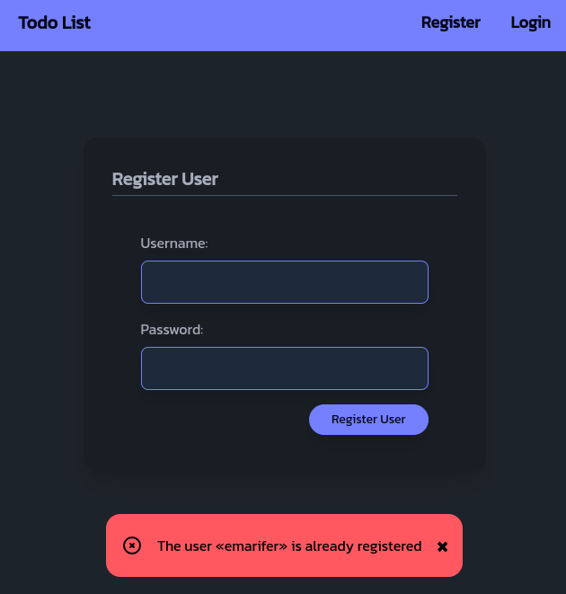
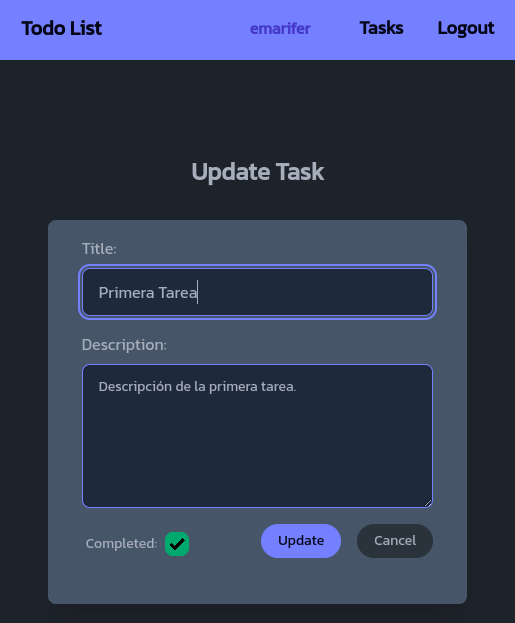

# Python/Flask to-do list app with user login and HTMx-powered frontend (Demo)

A full-stack application using Python's Flask framework with session-based authentication. Once we are authenticated we can enter a view from which we can manage a list of tasks (list, update and delete). Requests to the backend are controlled by [</>htmx](https://htmx.org/) ([hypermedia](https://hypermedia.systems/) only).

### Explanation

The application allows us to perform a complete CRUD on the database, in this case SQLite3, but the Flask ORM (Flask-SQLAlchemy) allows us to use any SQL database.

The DB stores both a table with the users and another table for each user's to-do. Both tables are related using a foreign key.

The use of </>html allows behavior similar to that of a SPA, without page reloads when switching from one route to another or when making requests (via AJAX) to the backend.

On the other hand, the styling of the views is achieved through Tailwind CSS and DaisyUI that are obtained from their respective CDNs.

Finally, minimal use of [_hyperscript](https://hyperscript.org/) is made to achieve the action of closing the alerts when they are displayed.

---

## Screenshots:

###### Todo List Page with success alert:


<br>

###### Sign Up Page with error alert:



<br>

###### Task update page:



---

## Setup:

As a prerequisite, we must have Python installed on our machine, in addition to the libraries that in our operating system allow us to create a virtual environment for the installation of the required dependencies.

To activate the virtual environment (On Unix/MacOS or Windows):

```
your@user:~/path/to/the/app/flask-htmx-todolist$ source .venv/bin/activate # On Windows, run: .venv\Scripts\activate
```

To install the dependencies:

```
(.venv) your@user:~/path/to/the/app/flask-htmx-todolist$ pip install -r requirements.txt
```

To start the application in development mode (with DEBUG mode activated):

```
$ python3 run.py #  On Windows, run: python run.py
```

To run the application in production, first you would have to change the configuration in the __init__.py file (pass the DEGUB = False attribute). Then install gunicorn (Python WSGI HTTP server for UNIX [pip install gunicorn]) and launch the application with the command:

```
$ gunicorn run:app
```

### Happy coding 😀!!